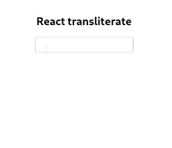

# React Transliterate

Transliterate component for React. Uses API from [Google Input Tools](https://www.google.com/inputtools)

[](https://www.npmjs.com/package/react-transliterate) [](https://standardjs.com)



[See Demo](https://burhanuday.tech/react-transliterate/)

## Install

```bash
npm install --save react-transliterate
yarn add react-transliterate
```

## Usage

```jsx
import React, { useState } from "react";

import { ReactTransliterate } from "react-transliterate";
import "react-transliterate/dist/index.css";

const App = () => {
  const [text, setText] = useState("");

  return (
    <div className="container">
      <h2>React transliterate</h2>
      <ReactTransliterate
        value={text}
        onChange={(e) => setText(e.target.value)}
        lang="hi"
      />
    </div>
  );
};

export default App;
```

### Props

| Props     | Required? | Default | Description                                                                                         |
| --------- | --------- | ------- | --------------------------------------------------------------------------------------------------- |
| onChange  | Yes       |         | onChange function to pass to the component. Return the event from the component                     |
| value     | Yes       |         | value prop to pass to the component                                                                 |
| Component |           | input   | Component to render. You can pass components from your component library as this prop               |
| lang      |           | hi      | Language you want to transliterate. Tested languages are `hi`, `mr`, `ur`. More languages to follow |
| offsetY   |           | 0       | Extra space between the top of the helper and bottom of the caret                                   |
| offsetX   |           | 0       | Extra space between the caret and left of the helper                                                |

## License

MIT © [burhanuday](https://github.com/burhanuday)
