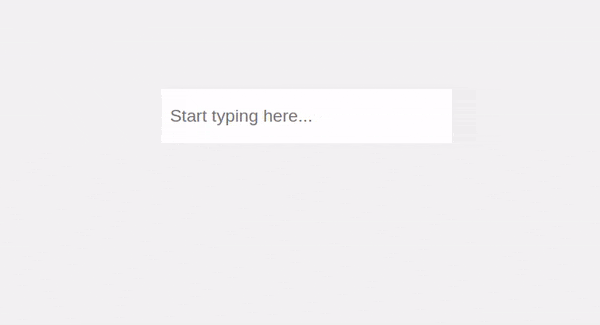

<h1 align="center">React Transliterate</h1>

Transliteration component for React with support for over 30 languages. Uses API from [Google Input Tools](https://www.google.com/inputtools)

[](https://www.npmjs.com/package/react-transliterate)

<p align="center">
</img>
</p>

## Demo

[See Demo](https://burhanuday.tech/react-transliterate/)

## Install

```bash
npm install --save react-transliterate

OR

yarn add react-transliterate
```

## Usage

### Basic example

```jsx
import React, { useState } from "react";

import { ReactTransliterate } from "react-transliterate";
import "react-transliterate/dist/index.css";

const App = () => {
  const [text, setText] = useState("");

  return (
    <ReactTransliterate
      value={text}
      onChangeText={(text) => {
        setText(text);
      }}
      lang="hi"
    />
  );
};

export default App;
```

### With custom component

```jsx
import React, { useState } from "react";

import { ReactTransliterate } from "react-transliterate";
import "react-transliterate/dist/index.css";

const App = () => {
  const [text, setText] = useState("");

  return (
    <ReactTransliterate
      renderComponent={(props) => <textarea {...props} />}
      value={text}
      onChangeText={(text) => {
        setText(text);
      }}
      lang="hi"
    />
  );
};

export default App;
```

### Usage with TypeScript

```tsx
import React, { useState } from "react";

import { ReactTransliterate, Language } from "react-transliterate";
import "react-transliterate/dist/index.css";

const App = () => {
  const [text, setText] = useState("");
  const [lang, setLang] = useState<Language>("hi");

  return (
    <ReactTransliterate
      renderComponent={(props) => <textarea {...props} />}
      value={text}
      onChangeText={(text) => {
        setText(text);
      }}
      lang={lang}
    />
  );
};

export default App;
```

### With material ui

```tsx
import React, { useState } from "react";

import { ReactTransliterate, Language } from "react-transliterate";
import "react-transliterate/dist/index.css";

import Input from "@material-ui/core/Input";

const App = () => {
  const [text, setText] = useState("");
  const [lang, setLang] = useState<Language>("hi");

  return (
    <ReactTransliterate
      renderComponent={(props) => {
        const inputRef = props.ref;
        delete props["ref"];
        return <Input {...props} inputRef={inputRef} />;
      }}
      value={text}
      onChangeText={(text) => {
        setText(text);
      }}
      lang={lang}
    />
  );
};

export default App;
```

For a full example, take a look at the `example` folder

### Props

| Props                            | Required? | Default                           | Description                                                                                                                          |
| -------------------------------- | --------- | --------------------------------- | ------------------------------------------------------------------------------------------------------------------------------------ |
| onChangeText                     | Yes       |                                   | Listener for the current value from the component. `(text: string) => void`                                                          |
| value                            | Yes       |                                   | `value` prop to pass to the component                                                                                                |
| renderComponent                  |           | `(props) => <input {...props} />` | Component to render. You can pass components from your component library as this prop                                                |
| lang                             |           | hi                                | Language you want to transliterate. See the following section for language codes                                                     |
| maxOptions                       |           | 5                                 | Maximum number of suggestions to show in helper                                                                                      |
| offsetY                          |           | 0                                 | Extra space between the top of the helper and bottom of the caret                                                                    |
| offsetX                          |           | 0                                 | Extra space between the caret and left of the helper                                                                                 |
| containerClassName               |           | empty string                      | Classname passed to the container of the component                                                                                   |
| containerStyles                  |           | {}                                | CSS styles object passed to the container                                                                                            |
| activeItemStyles                 |           | {}                                | CSS styles object passed to the active item `<li>` tag                                                                               |
| hideSuggestionBoxOnMobileDevices |           | true                              | Should the suggestions be visible on mobile devices since keyboards like Gboard and Swiftkey support typing in multiple languages    |
| hideSuggestionBoxBreakpoint      |           | 450                               | type: `number`. To be used when `hideSuggestionBoxOnMobileDevices` is true. Suggestion box will not be shown below this device width |

### Supported Languages

| Language              | Code     |
| --------------------- | -------- |
| Amharic               | am       |
| Arabic                | ar       |
| Bangla                | bn       |
| Belarusian            | be       |
| Bulgarian             | bg       |
| Chinese (Hong Kong)   | yue-hant |
| Chinese (Simplified)  | zh       |
| Chinese (Traditional) | zh-hant  |
| French                | fr       |
| German                | de       |
| Greek                 | el       |
| Gujarati              | gu       |
| Hebrew                | he       |
| Hindi                 | hi       |
| Italian               | it       |
| Japanese              | ja       |
| Kannada               | kn       |
| Malayalam             | ml       |
| Marathi               | mr       |
| Nepali                | ne       |
| Odia                  | or       |
| Persian               | fa       |
| Portuguese (Brazil)   | pt       |
| Punjabi               | pa       |
| Russian               | ru       |
| Sanskrit              | sa       |
| Serbian               | sr       |
| Sinhala               | si       |
| Spanish               | es       |
| Tamil                 | ta       |
| Telugu                | te       |
| Tigrinya              | ti       |
| Ukrainian             | uk       |
| Urdu                  | ur       |
| Vietnamese            | vi       |

## License

MIT © [burhanuday](https://github.com/burhanuday)
